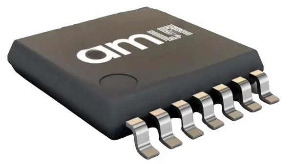
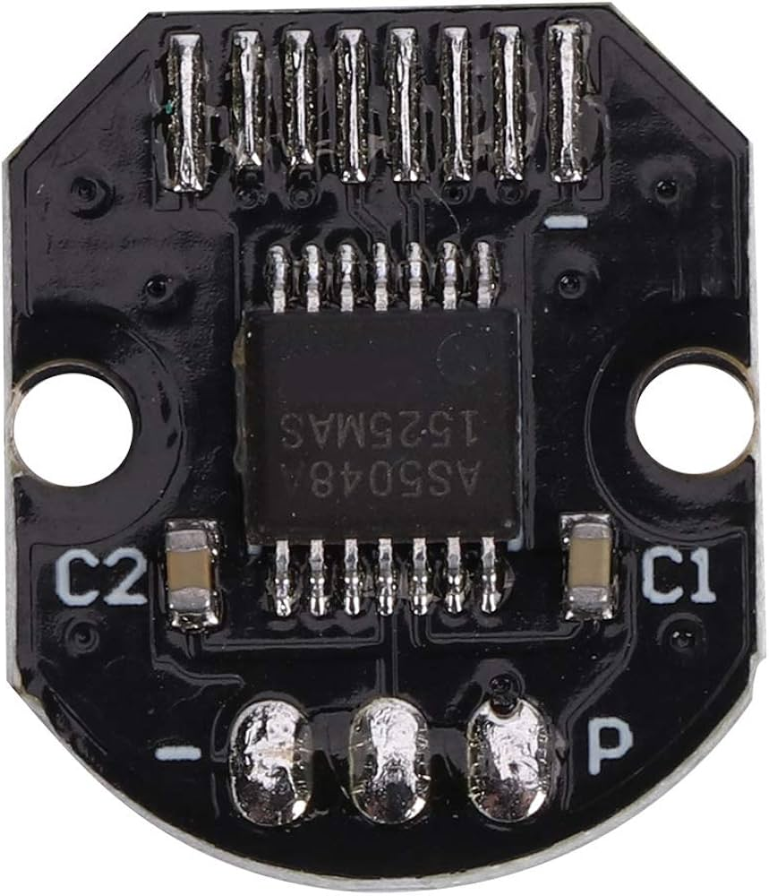

# AS5048A STM32 Driver

<div align="center">
  

  <p><strong>A C++ driver for the AS5048A 14-bit magnetic rotary encoder, built on STM32 HAL.</strong></p>

  [](https://www.st.com/en/embedded-software/stm32cube-mcu-mpu-packages.html)
  [](https://isocpp.org/)
  [](https://ams-osram.com/products/sensor-solutions/position-sensors/ams-as5048a-high-resolution-position-sensor)
  [](https://sylas-project.github.io/as5048a/)
  [](LICENSE)
</div>

> [!NOTE]
> The ams OSRAM logo, product images, pinout, datasheet, and AS5048A name are
> third-party materials or marks belonging to their respective owner. Their
> presence does not imply sponsorship or endorsement. See
> [Third-party notices](#third-party-notices).

<div align="center">
  
</div>

## Features

- 14-bit absolute angular position with raw, degree, and radian output
- 16-bit SPI transport with even-parity generation and validation
- Full samples containing angle, CORDIC magnitude, AGC, and magnetic diagnostics
- Pipelined continuous-angle reads for lower-overhead control loops
- Volatile zero-position read, write, and set-current-position operations
- Communication-error reporting with STM32 HAL status propagation
- CMake target that drops into an STM32CubeMX-generated project

## Requirements

- An STM32G4 project generated with STM32CubeMX or CubeIDE using CMake
- STM32 HAL GPIO and SPI support
- A C++17-capable ARM toolchain
- CMSIS DWT cycle-counter support for microsecond chip-select timing
- One full-duplex SPI peripheral and one GPIO output for active-low `CSn`
- A diametrically magnetized magnet and mechanical arrangement that meets the
  sensor datasheet requirements

Keep the bundled [AS5048A datasheet](docs/datasheet.pdf) close while reviewing
electrical limits, SPI timing, magnet placement, accuracy, and package details.

## Add it to an STM32 project

From the root of your firmware repository, clone the driver into a components
directory:

```bash
mkdir -p Components
git clone https://github.com/sylas-project/as5048a.git Components/As5048a
```

Or track it as a submodule:

```bash
git submodule add https://github.com/sylas-project/as5048a.git Components/As5048a
git submodule update --init --recursive
```

Add the component after CubeMX defines the `stm32cubemx` target:

```cmake
add_subdirectory(Components/As5048a)
target_link_libraries(${CMAKE_PROJECT_NAME} PRIVATE as5048a)
```

The driver publishes its `Inc` directory and links against `stm32cubemx`, so
application code only needs:

```cpp
#include "as5048a/as5048a.hpp"
```

## STM32CubeMX setup

Configure the SPI peripheral as follows:

| Setting | Value |
|---|---|
| Mode | Master |
| Direction | Two-line full duplex |
| HAL data size | 8 bits |
| First bit | MSB first |
| Clock polarity | Low |
| Clock phase | Second edge (SPI mode 1) |
| NSS | Software |
| Clock frequency | 10 MHz maximum |
| Hardware CRC | Disabled |

Configure `CSn` as a push-pull GPIO output that idles high. The driver sends
each 16-bit AS5048A frame as two 8-bit values while holding chip select low.

<div align="center">
  
</div>

The image shows the IC pinout, not the wiring for a specific board. Verify the
pin functions, supply, decoupling, logic levels, and magnet requirements against
the datasheet revision used by your hardware.

## Quick start

Create a long-lived driver after CubeMX's peripheral handles exist:

```cpp
#include "as5048a/as5048a.hpp"

As5048a encoder({
    .spi = &hspi1,
    .chipSelect = {GPIOA, GPIO_PIN_4},
    .spiTimeoutMs = 100U,
});

void startEncoder()
{
    if (encoder.initialize() != HAL_OK) {
        Error_Handler();
    }
}
```

Read a complete, diagnostics-checked sample:

```cpp
AS5048A_Sample_t sample{};

if (encoder.sample(sample) == HAL_OK && sample.valid) {
    const uint16_t raw = sample.angle.raw;
    const float degrees = sample.angle.degrees;
    const float radians = sample.angle.radians;
}
```

`sample()` reads angle, magnitude, and diagnostics. It sets `valid` only when
all transfers succeed, offset compensation has finished, no CORDIC overflow is
present, and the magnet is neither too strong nor too weak.

## Fast angle polling

The AS5048A returns the response to an SPI command one frame later. Prime the
pipeline once, then retrieve one angle on every subsequent transfer:

```cpp
if (encoder.beginContinuousAngleRead() != HAL_OK) {
    Error_Handler();
}

AS5048A_Angle_t angle{};
while (encoder.readNextAngle(angle) == HAL_OK) {
    updateControlLoop(angle.radians);
}
```

The fast path validates response parity and the sensor error flag, but does not
read magnitude or magnetic diagnostics. After any failure, call
`beginContinuousAngleRead()` before retrying.

## Zero position and communication errors

Set the current mechanical position as the volatile zero point:

```cpp
if (encoder.setCurrentPositionAsZero() != HAL_OK) {
    Error_Handler();
}
```

You can also use `readZeroPosition()` and `writeZeroPosition()` with values from
0 through 16,383. These operations do not burn OTP, so restore the desired
offset after power cycling.

Read and clear the sensor's latched framing, invalid-command, and parity errors:

```cpp
uint16_t rawErrors = 0U;
if (encoder.clearCommunicationErrors(rawErrors) != HAL_OK) {
    Error_Handler();
}
```

## Example hardware

<div align="center">
  
  
</div>

Use a diametrically magnetized two-pole magnet centered above the package.
Air gap, lateral displacement, tilt, magnet strength, nearby ferromagnetic
material, and shaft runout all affect accuracy. Use AGC, magnitude, and the
diagnostic flags while validating the final mechanical assembly.

## Documentation

The Sphinx source lives in [`docs-site`](docs-site). With the repository's
micromamba environment active, build it with:

```bash
micromamba activate bldc-sim
cd firmware/Components/As5048a/docs-site
make html
```

Open `build/html/index.html`. The published documentation includes installation,
CubeMX setup, wiring, usage, the complete public API, data types, register and
protocol references, troubleshooting, and the downloadable datasheet.

## Project layout

```text
.
├── Inc/as5048a/       Public C++ API, C-compatible types, and register definitions
├── Src/               STM32 HAL implementation
├── docs/              Bundled AS5048A datasheet
├── docs-site/         Sphinx documentation website
├── media/             Logo, IC, pinout, and module images
├── CMakeLists.txt     Reusable `as5048a` static-library target
└── LICENSE            License placeholder (currently empty)
```

## Contributing

Issues and focused pull requests are welcome. When changing behavior, update the
relevant documentation and verify the driver against the target STM32 and
AS5048A hardware.

## License

No license has been selected yet. The empty [`LICENSE`](LICENSE) file is a
placeholder; **all rights remain with the copyright holder unless a license is
added**.

## Third-party notices

ams OSRAM and other respective rights holders retain all rights in trademarks
and copyrighted materials included or referenced here:

- The ams OSRAM logo in [`media/ams-logo.svg.png`](media/ams-logo.svg.png)
- The AS5048A product images in [`media`](media)
- The AS5048A pinout artwork in
  [`media/as5048a-pinout.png`](media/as5048a-pinout.png)
- The bundled [AS5048A datasheet](docs/datasheet.pdf)
- The names “ams OSRAM,” “ams,” and “AS5048A”

These materials are provided for identification and technical reference only
and are not covered by any future license applied to this repository's source
code. This independent project is not affiliated with, sponsored by, or
endorsed by ams OSRAM. Verify that use and redistribution of each asset complies
with the applicable copyright and trademark terms. Prefer linking to the
[official AS5048A product page](https://ams-osram.com/products/sensor-solutions/position-sensors/ams-as5048a-high-resolution-position-sensor)
when redistributing the datasheet is unnecessary.
