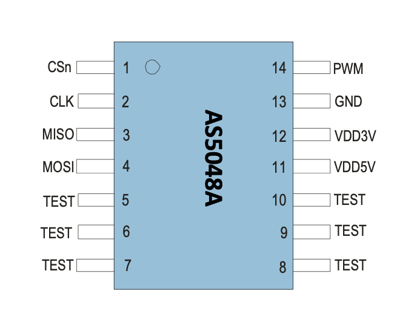
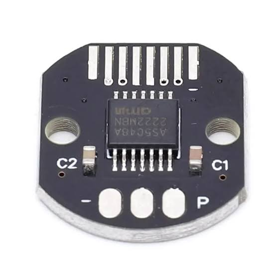

Sensor and wiring
=================

The SPI interface uses ``SCK``, ``MOSI``, ``MISO``, and active-low ``CSn``.
Connect the sensor and controller grounds, use a supply and logic levels that
meet the datasheet, place decoupling close to the device, and keep the magnetic
and mechanical assembly within the specified tolerances. The pinout above is
an IC reference, not a board-specific wiring diagram.

The AS5048A also exposes a PWM output, but this library communicates only over
SPI. The driver does not configure the PWM pin, program OTP, or abstract board
power control.

Magnet placement
----------------

Use a diametrically magnetized two-pole magnet centered above the package.
Air gap, lateral displacement, tilt, magnet strength, nearby ferromagnetic
material, and shaft runout all affect accuracy. Check the diagnostic flags and
AGC value during mechanical validation rather than treating a plausible angle
as proof of correct alignment.

Consult the :download:`AS5048A datasheet <_static/as5048a-datasheet.pdf>` for
the authoritative pin functions, absolute maximum ratings, recommended
operating conditions, timing, magnet requirements, and package drawings.

