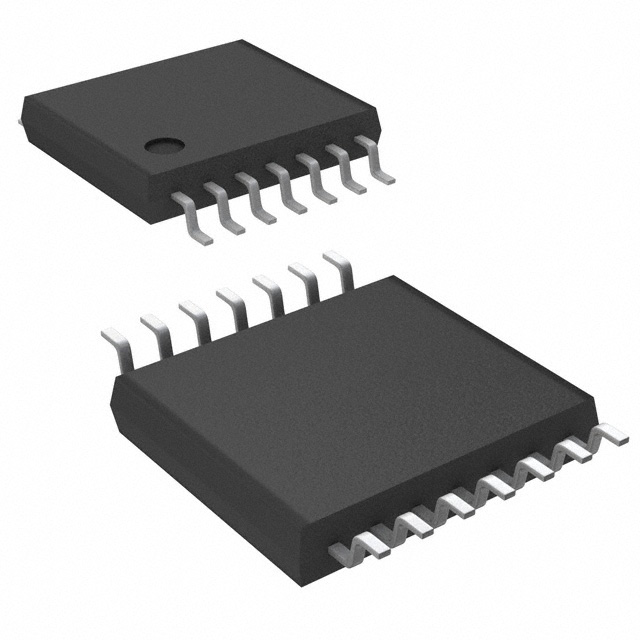

AS5048A STM32 driver
====================

A small C++17 driver for the **AS5048A 14-bit absolute magnetic rotary
encoder**, built on the STM32G4 HAL. It handles SPI parity, the sensor's
one-frame-delayed replies, angle conversion, magnetic diagnostics, and the
volatile zero-position registers.

The AS5048A reports one of 16,384 angular positions per revolution. This is
about 0.02197 degrees per count. It senses a diametrically magnetized magnet
above the package and provides absolute position after power-up; no homing
sequence is required by the sensor itself.

This is an independent driver. Product images, the ams OSRAM mark, and the
datasheet remain the property of their respective owner. Always use the
:download:`bundled datasheet <_static/as5048a-datasheet.pdf>` as the authority
for electrical limits, magnet placement, timing, and package dimensions.

.. toctree::
   :maxdepth: 2
   :caption: Start here

   getting-started
   hardware
   usage

.. toctree::
   :maxdepth: 2
   :caption: Reference

   api
   data-types
   registers
   troubleshooting
   documentation

