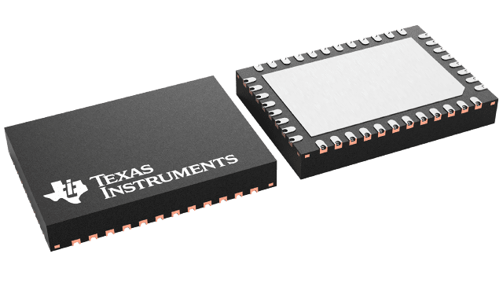
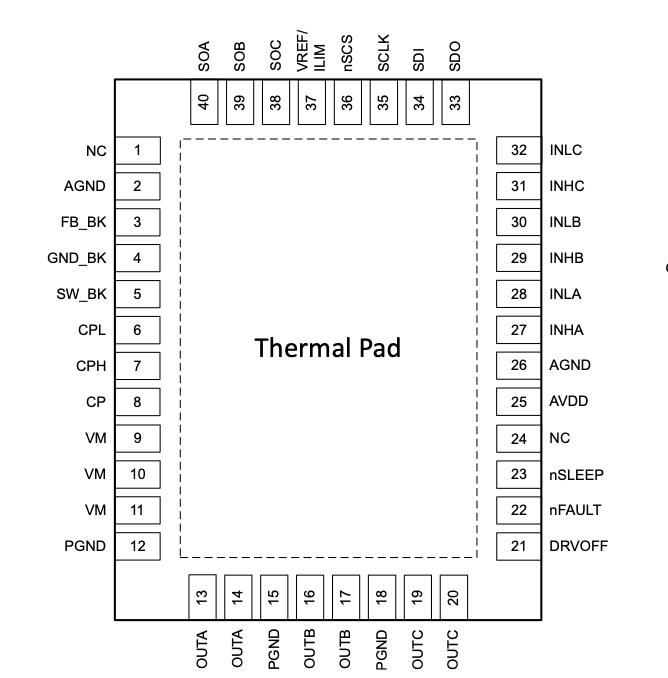

# DRV8316 STM32 Driver

<div align="center">
  

  <p><strong>A typed C++ driver for the TI DRV8316 three-phase motor driver, built on STM32 HAL.</strong></p>

  [](https://www.st.com/en/embedded-software/stm32cube-mcu-mpu-packages.html)
  [](https://isocpp.org/)
  [](https://www.ti.com/product/DRV8316)
  [](https://sylas-project.github.io/drv8316/)
  [](LICENSE)
</div>

> [!NOTE]
> The TI logo, product image, pinout, datasheet, TI name, and DRV8316 name are
> third-party materials or marks belonging to Texas Instruments. Their presence
> does not imply TI sponsorship or endorsement. See
> [Third-party notices](#third-party-notices). The repository's `LICENSE` file
> is currently empty, so choose and add a code license before distribution.

<div align="center">
  
</div>

## Features

- 16-bit SPI transport with parity generation and STM32 HAL status propagation
- Strongly typed configuration for PWM mode, slew rate, OCP, CSA, buck supply,
  delay compensation, and other DRV8316 controls
- Fault-pin polling and on-demand IC, bridge, SPI, thermal, and buck diagnostics
- Sleep/wake control and three-channel timer compare updates
- CMake target that drops into an STM32CubeMX-generated CMake project

## Requirements

- An STM32G4 project generated with STM32CubeMX/CubeIDE using CMake
- STM32 HAL, including GPIO, SPI, and TIM support
- A C++17-capable ARM toolchain
- One SPI peripheral configured for 16-bit DRV8316 frames (the driver transfers
  each frame as two 8-bit bytes), plus GPIOs for `nSCS` and `nSLEEP`
- An optional input GPIO for `nFAULT`
- A timer with channels 1–3 configured when using `setPwm()`

Keep the bundled [DRV8316 datasheet](docs/datasheet.pdf) close while reviewing
SPI timing, electrical limits, the reference schematic, and PCB layout.

## Add it to an STM32 project

From the root of your firmware repository, clone the driver into a components
directory:

```bash
mkdir -p Components
git clone https://github.com/sylas-project/drv8316.git Components/DRV8316
```

Or track it as a submodule:

```bash
git submodule add https://github.com/sylas-project/drv8316.git Components/DRV8316
git submodule update --init --recursive
```

Add the component after the CubeMX-generated `stm32cubemx` target is defined:

```cmake
add_subdirectory(Components/DRV8316)
target_link_libraries(${CMAKE_PROJECT_NAME} PRIVATE drv8316)
```

The driver already publishes its `Inc` directory and links against
`stm32cubemx`, so application code only needs:

```cpp
#include "drv8316/drv8316.hpp"
```

## STM32CubeMX setup

1. Enable an SPI peripheral as full-duplex master. Use the mode, bit order,
   clock limits, and timing specified by the DRV8316 datasheet.
2. Configure `nSCS` as a push-pull output and leave it high while idle.
3. Configure `nSLEEP` as a push-pull output.
4. Optionally configure `nFAULT` as a pulled-up input (and an EXTI source if
   your application needs interrupt-driven fault handling).
5. For `setPwm()`, configure PWM outputs on channels 1, 2, and 3 of the same
   timer and start those channels before updating compare values.
6. Generate CMake project files and ensure C++ is enabled for the application
   target.



This is the IC package pinout; verify it against the datasheet revision used by
your hardware and add your board's MCU-to-driver mapping separately. See the
[wiring guide](https://sylas-project.github.io/drv8316/getting-started/wiring)
for the signal-level checklist.

## Quick start

```cpp
#include "drv8316/drv8316.hpp"

Drv8316 motorDriver({
    .spi = &hspi1,
    .timer = &htim1,
    .chipSelect = {GPIOA, GPIO_PIN_4},
    .fault = {GPIOB, GPIO_PIN_0},
    .sleep = {GPIOB, GPIO_PIN_1},
    .spiTimeoutMs = 100U,
});

void startMotorDriver()
{
    HAL_TIM_PWM_Start(&htim1, TIM_CHANNEL_1);
    HAL_TIM_PWM_Start(&htim1, TIM_CHANNEL_2);
    HAL_TIM_PWM_Start(&htim1, TIM_CHANNEL_3);

    if (motorDriver.initialize() != HAL_OK) {
        Error_Handler();
    }

    motorDriver.setPwmMode(DRV8316_PWM_MODE_6X);
    motorDriver.setSlewRate(DRV8316_SLEW_RATE_50V_US);
    motorDriver.setPwm(0U, 0U, 0U);
}
```

`initialize()` wakes the device, unlocks its registers, enables the driver,
clears faults, refreshes diagnostics, and selects the 0.15 V/A current-sense
gain. Check every returned `HAL_StatusTypeDef` in production code.

## Fault handling

```cpp
if (motorDriver.isFaultPinAsserted()) {
    if (motorDriver.refreshDiagnostics() == HAL_OK) {
        const auto &faults = motorDriver.diagnostics();
        // Inspect faults.ic_status, faults.status_1, and faults.status_2.
    }
}
```

The detailed status registers are refreshed only when `IC_STATUS` indicates
that detail is required. See the
[diagnostics reference](https://sylas-project.github.io/drv8316/guides/diagnostics).

## Documentation

The Sphinx source lives in [`docs-site`](docs-site). Build it locally with:

```bash
cd docs-site
python3 -m venv .venv
. .venv/bin/activate
python -m pip install -r requirements.txt
make html
```

Open `build/html/index.html`. The documentation
includes installation, CubeMX setup, wiring, configuration, diagnostics, API,
register, and deployment references.

## Project layout

```text
.
├── Inc/drv8316/       Public C++ API, types, and register definitions
├── Src/               STM32 HAL implementation
├── docs-site/         Sphinx documentation website
├── CMakeLists.txt     Reusable `drv8316` static-library target
└── LICENSE            License placeholder (currently empty)
```

## Contributing

Issues and focused pull requests are welcome. When changing behavior, update the
relevant documentation and verify the driver against the target STM32 and
DRV8316 hardware.

## License

No license has been selected yet. The empty [`LICENSE`](LICENSE) file is a
placeholder; **all rights remain with the copyright holder unless a license is
added**.

## Third-party notices

Texas Instruments Incorporated retains all rights in its trademarks and
copyrighted materials included or referenced here:

- The TI logo in [`media/ti_logo.png`](media/ti_logo.png)
- The DRV8316 package render in [`media/drv8316.png`](media/drv8316.png)
- The DRV8316 pinout artwork in
  [`media/drv8316-pinout.png`](media/drv8316-pinout.png)
- The bundled [DRV8316 datasheet](docs/datasheet.pdf)
- The names “Texas Instruments,” “TI,” and “DRV8316”

These materials are provided for identification and technical reference only
and are not covered by any future license applied to this repository's source
code. This is an independent community project, not an official TI product.
Verify that your use and redistribution of each asset complies with TI's terms,
copyright notices, and trademark guidelines. Prefer linking to the
[official DRV8316 product page](https://www.ti.com/product/DRV8316) when
redistributing the datasheet is unnecessary.
